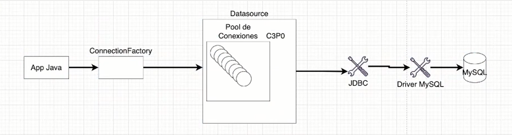

# 2. Java y JDBC: Trabajando con una Base de Datos Java y JDBC

---

<aside>
💡 Para limpiar la consoloa de mysql usar: `\! clear`

</aside>

```sql
CREATE DATABASE control_de_stock;

USE control_de_stock;

CREATE TABLE producto(
	id INT AUTO_INCREMENT,
	nombre VARCHAR(50) NOT NULL,
  descripcion VARCHAR(255),
  cantidad INT NOT NULL DEFAULT 0,
  PRIMARY KEY(id)
) Engine=InnoDB;
```

---

- Para acceder a una base de datos necesitamos del **driver de conexión**;
    - Un driver es simplemente una librería **.jar**.
- **JDBC** significa *Java DataBase Connectivity*;
    - El JDBC define una capa de abstracción entre la aplicación y el driver de la base de datos.
    - Esta capa es compuesta de interfaces que el driver implementa.
- Para abrir una conexión con la base de datos debemos utilizar el método `getConnection` de la clase `DriverManager`;
    - El método `getConnection` recibe tres parámetros. Son ellos la URL de conexión JDBC, el usuario y la contraseña.

---

# 1. Crear conexion

Para crear una conexion, necesitamos instanciar un objeto de la clase Connection y a dicha instancia le debemos asignar la referencia de la clase DriverManager.getConnection();

****************Ejemplo:****************

```java
**Connection con = DriverManager.getConnection(param1);**
```

Donde el parametro de la clase DriverManager.getConnection(), puede recibir:

- **String (url)**: la url de conexion que puede contener solamente la url o la url junto el usuario y la contraseña.
- **************String(user):************** el nombre de usaurio de acceso a la base de datos.
- **************String(pass):************** La contraseña del usuario para acceder a la base de datos.

La ********URL******** de conexion sigue el siguiente formato:

> “jdbc:****base de datos****://****url : port****/**nombre_base_de_datos?params=value&params=value”**
> 

Donde:

- ******Base de datos:****** el nombre de la base de datos a la cual nos vamos a conectar (mysql, mariadb, postgresql,etc)
- ******URL:****** Url de la conexion a la base de datos, [localhost](http://localhost) si se trabaja de manera local en un solo equipo o la direcion ******IP****** hacia donde se hara la conexion a la base de datos.
- ********PORT:******** Puerto por el cual se hara la conexion a la base de datos.
- ************Nombre de la base de datos:************ Es el nombre de la base de datos a la cual nos vamos a conectar.
- **************Params:************** Parametros que le podemos enviar en la conexion como la zona horaria, etc.

## Ejemplo de conexion

```java
******//conexion a DB en java
//creamos un objeto de tipo Connection
String url = "jdbc:mysql://localhost:3306/control_de_stock/";
String user = "root";
String pass = "2011.1994";
Connection con = DriverManager.getConnection(url, user, pass);

con.close();******
```

# 2.Ejecutar Querys

Para realizar alguna consulta hacia una base de datos desde java necesitamos seguir los siguientes pasos:

1. Crear una conexion a la base de datos.
2. Crear un ******************statement****************** o preparedStatement. Asignando a una variable de tipo ********************Statement******************** el objeto devuelto por la ejecucion del metodo ************CreateStatement************ del objeto de la conexion.
3. Ejecutar el **statement.** Ejecutamos el metodo ****************Execute**************** del objeto ****Statement**** que creamos, este metodo recibe como parametro un String con la query en lenguage ********SQL******** que queramos ejecutar.
4. Verificar el resultado del statement (opcional)
5. Obtener los resultados, es decir, asignar el resultado de la consulta a un objeto de tipo **ResultSet** debido a que es este tipo de objeto el que devuelve la ejecucion del ********************statement.********************
6. Cerrar la conexion

## **************Ejemplo**************

Creamos una conexion a la base de datos.

```java
//conexion a DB en java
//creamos un objeto de tipo Connection
String url = "jdbc:mysql://localhost:3306/control_de_stock/";
String user = "root";
String pass = "2011.1994";
Connection con = DriverManager.getConnection(url, user, pass);

```

Creamos un ********************Statement********************  y lo ejecutamos con el metodo ****************execute.****************

```java
//Instanciamoes un objeto de tipo Statement
Statement selectQuery = con.createStatement();
//Executamos la consulta, si esta se ejecuta correctamente nuestro statement 
//almacenara los resultados internamente en nuestro objeto de Statement
selectQuery.execute("SELECT *FROM producto");

```

Obtenemos los resultados

```java
//Los resultados se alamcenan internamente en nuestro objeto de tipo Statement
//para acceder a ellos hacemos uso del metodo getResult() y almacenamos dichos
//resultados en un objeto de tipo ResultSet
ResultSet resultado = selectQuery.getResultSet();
```

Para iterar sobre ellos podemos hacerlo con un ciclo ************while************ como si se tratase de un iterator podemos llamar al metodo **************next()************** e iterara hasta que ya no haya mas elementos disponibles en el ********************resultSet.******************** Al iterar sobre un ResulSet obtendremos una **********fila********** de la consulta hecha a la base de datos y para acceder a cada ************campo************ o valor de cada ****************columna**************** tenemos que especificar el tipo de dato de cada columna y especificar el nombre del campo de la tabla a la cual hicimos la consulta, tambien podemos hacer uso de indices, pero es mas expresivo el uso directo de los nombres de las columnas de la tabla de la base de datos.

```java
///
while(resultado.next()){
	System.out.println(resultado.getInt("ID"));
	System.out.println(resultado.getString("Nombre"));
}
```

> Nota: siempre hay que cerrar cada conexion y statement que hagamos con el metodo **********.close();**********
> 

Codigo completo:

```java
	**public class DemoSQL {
	public static void main(String[] args){
		//conexion a DB en java
		//creamos un objeto de tipo Connection
		String url = "jdbc:mysql://localhost:3306/control_de_stock/";
		String user = "root";
		String pass = "2011.1994";
		Connection con = DriverManager.getConnection(url, user, pass);

		//Instanciamoes un objeto de tipo Statement
		Statement selectQuery = con.createStatement();
		//Executamos la consulta, si esta se ejecuta correctamente nuestro statement 
		//almacenara los resultados internamente en nuestro objeto de Statement
		selectQuery.execute("SELECT *FROM producto");

		//Los resultados se alamcenan internamente en nuestro objeto de tipo Statement
		//para acceder a ellos hacemos uso del metodo getResult() y almacenamos dichos
		//resultados en un objeto de tipo ResultSet
		ResultSet resultado = selectQuery.getResultSet();

		//Iteramos el resultset para mostrar los resultados
		while(resultado.next()){
			System.out.println(resultado.getInt("ID"));
			System.out.println(resultado.getString("Nombre"));
		}
		
		//cerramos la conexion y los statement
		selectQuery.close();
		con.close();

	}
}**
```

# 3. Statement vs PreparedStatement

El uso de ********************Statement********************  puede conllevar a problemas de seguridad y mas especificamente a problemas de inyeccion de codigo SQL, es por eso que se recomienda el uso de ****************PreparedStatement****************  el cual permite parametrizar los valores de los campos de las consultas SQL de tal manera que se pueden evitar problemas como el mencionado anteriormente.

Diferencias:

- *Statement* – **Used to execute string-based SQL queries:**
    - The ***Statement*** interface is suitable for DDL queries like CREATE, ALTER, and DROP
- *PreparedStatement* – **Used to execute parameterized SQL queries**
    - **it protects against SQL injection**, by escaping the text for all the parameter values provided.

## Ejemplo de PreparedStatement

El uso de PreparedStatement es similiar a Statement, solo hay que cambiar los metodos de ejecucion, si la consulta es de tipo INSERT, UPDATE, DELETE, o SELECT, vamos aquella consulta que necesite del envio de algun tipo de parametro, la String de la consulta debe ir parametrizada y aquellos valores que se requieran deberan ir especificados con el signo **********“?”.**********

En este ejemplo haremos una consulta de tipo INSERT por lo que veremos como PreparedStatement parametriza los valores a enviar a al DB.

Al crear el Statement cambiamos el tipo a **PreparedStatement** y executamos el metodo **PrepareStatement**() de la **conexion**.

```java
**//query sql los valores a insertar se parametrizan con ?**
String query = "INSERT INTO producto (nombre, descripcion, cantidad) VALUES (?, ?, ?)";
**//Instanciamoes un objeto de tipo Statement
		PreparedStatement insertQuery = con.prepareStatement(query);**
```

Como esta consulta requiere de que se le envien valores a la DB, los asignamos antes de executarla.

```java
**//para establecer los valores que fueron parametrizados usamos los metodos correspondientes
//para indicar el tipo de dato que se requiere enviar a la DB
//cada metodo que especifica el tipo de dato y el valor recibe dos parametros
//index: es el indice de los valores parametrizados en la consulta se cuentan desde 1
//valor: el valor a enviar

insertQuery.setString(1, "Celular");
insertQuery.setString(2, "Huawei Mate 20");
insertQuery.setInt(3, 50);**

```

Executamos el PreparedStatement

```java
//con el metodo execute() ejecutamos la consulta
insertQuery.execute();
```

Ejemplo completo

```java
	**public class DemoSQL {
	public static void main(String[] args){
		//conexion a DB en java
		//creamos un objeto de tipo Connection
		String url = "jdbc:mysql://localhost:3306/control_de_stock/";
		String user = "root";
		String pass = "2011.1994";
		Connection con = DriverManager.getConnection(url, user, pass);

		//query sql los valores a insertar se parametrizan con ?**
		String query = "INSERT INTO producto (nombre, descripcion, cantidad) VALUES (?, ?, ?)";
		
		**//Instanciamoes un objeto de tipo Statement
		PreparedStatement insertQuery = con.prepareStatement(query);
		
		//para establecer los valores que fueron parametrizados usamos los metodos correspondientes
		//para indicar el tipo de dato que se requiere enviar a la DB
		//cada metodo que especifica el tipo de dato y el valor recibe dos parametros
		//index: es el indice de los valores parametrizados en la consulta se cuentan desde 1
		//valor: el valor a enviar
		
		insertQuery.setString(1, "Celular");
		insertQuery.setString(2, "Huawei Mate 20");
		insertQuery.setInt(3, 50);**

		//**con el metodo execute() ejecutamos la consulta
		insertQuery.execute();

		//cerramos la conexion y los statement
		insertQuery.close();
		con.close();

	}
}**
```

## CRUD Operations con PreparedStatement

### CREATE

```java
	**public class DemoSQL {
	public static void main(String[] args){
		//conexion a DB en java
		//creamos un objeto de tipo Connection
		String url = "jdbc:mysql://localhost:3306/control_de_stock/";
		String user = "root";
		String pass = "2011.1994";
		Connection con = DriverManager.getConnection(url, user, pass);

		//query sql los valores a insertar se parametrizan con ?**
		String query = "INSERT INTO producto (nombre, descripcion, cantidad) VALUES (?, ?, ?)";
		
		**//Instanciamoes un objeto de tipo Statement
		PreparedStatement insertQuery = con.prepareStatement(query);
		
		//para establecer los valores que fueron parametrizados usamos los metodos correspondientes
		//para indicar el tipo de dato que se requiere enviar a la DB
		//cada metodo que especifica el tipo de dato y el valor recibe dos parametros
		//index: es el indice de los valores parametrizados en la consulta se cuentan desde 1
		//valor: el valor a enviar
		
		insertQuery.setString(1, "Celular");
		insertQuery.setString(2, "Huawei Mate 20");
		insertQuery.setInt(3, 50);**

		//**con el metodo execute() ejecutamos la consulta
		insertQuery.execute();

		//cerramos la conexion y los statement
		insertQuery.close();
		con.close();

	}
}**
```

### READ

```java
	**public class DemoSQL {
	public static void main(String[] args){
		//conexion a DB en java
		//creamos un objeto de tipo Connection
		String url = "jdbc:mysql://localhost:3306/control_de_stock/";
		String user = "root";
		String pass = "2011.1994";
		Connection con = DriverManager.getConnection(url, user, pass);

		//query sql los valores a insertar se parametrizan con ?**
		String query = "SELECT *FROM producto";
		
		**//Instanciamoes un objeto de tipo Statement
		PreparedStatement selectQuery = con.prepareStatement(query);**

		//**con el metodo execute() ejecutamos la consulta
		selectQuery .execute();
		ResultSet res = selectQuery.getResultSet();

		//TODO SHOW QUERY RESULTS
		while(res.next()){
		}

		//cerramos la conexion y los statement
		selectQuery .close();
		con.close();

	}
}**
```

### UPDATE

```java
	**public class DemoSQL {
	public static void main(String[] args){
		//conexion a DB en java
		//creamos un objeto de tipo Connection
		String url = "jdbc:mysql://localhost:3306/control_de_stock/";
		String user = "root";
		String pass = "2011.1994";
		Connection con = DriverManager.getConnection(url, user, pass);

		//query sql los valores a insertar se parametrizan con ?**
		String query = "UPDATE producto SET ?, ?, ? WHERE id=?";
		
		**//Instanciamoes un objeto de tipo Statement
		PreparedStatement upadteQuery = con.prepareStatement(query);
		
		//para establecer los valores que fueron parametrizados usamos los metodos correspondientes
		//para indicar el tipo de dato que se requiere enviar a la DB
		//cada metodo que especifica el tipo de dato y el valor recibe dos parametros
		//index: es el indice de los valores parametrizados en la consulta se cuentan desde 1
		//valor: el valor a enviar

		//nombre del elemento a modificar
		upadteQuery.setString(1, "IPHONE");
		//descripcion del producto
		upadteQuery.setString(2, "XR Reacondicionado");
		//cantidad del producto
		upadteQuery.setInt(3, 25);
		//como es un UPDATE y es el ultimo valor paremtrizado = 4, el id de la query=1 
		upadteQuery.setInt(4, 1);**

		//**con el metodo execute() ejecutamos la consulta
		upadteQuery.execute();

		//cerramos la conexion y los statement
		upadteQuery.close();
		con.close();

	}
}**
```

### DELETE

```java
	**public class DemoSQL {
	public static void main(String[] args){
		//conexion a DB en java
		//creamos un objeto de tipo Connection
		String url = "jdbc:mysql://localhost:3306/control_de_stock/";
		String user = "root";
		String pass = "2011.1994";
		Connection con = DriverManager.getConnection(url, user, pass);

		//query sql los valores a insertar se parametrizan con ?**
		String query = "DELETE FROM producto WHERE id=?";
		
		**//Instanciamoes un objeto de tipo Statement
		PreparedStatement deleteQuery = con.prepareStatement(query);
		
		//para establecer los valores que fueron parametrizados usamos los metodos correspondientes
		//para indicar el tipo de dato que se requiere enviar a la DB
		//cada metodo que especifica el tipo de dato y el valor recibe dos parametros
		//index: es el indice de los valores parametrizados en la consulta se cuentan desde 1
		//valor: el valor a enviar

		//nombre del elemento a modificar
		deleteQuery.setInt(1, 2);**

		//**con el metodo execute() ejecutamos la consulta
		deleteQuery.execute();

		//cerramos la conexion y los statement
		deleteQuery.close();
		con.close();

	}
}**
```

---

# 4. Control de transacciones

Por defecto al ejecutar una consulta de SQL a traves de las interfaces provistas por Java, estas se ejecutan automaticamente desde principio a fin por lo que si una consulta tiene algun tipo de error enmedio de su ejecucion esta se ejecutara y se completara hasta el momento en el que ocurrio el error enviando datos no complentos a la base de datos.

Para manejar lo mencionado anteriormente contamos con tres metodos provistos por la interface DriverManager para manejar estos problemas, estos son:

- ****************setAutoCommit(param):**************** Deshabilita la opcion por defecto de completar las transacciones o consultas automaticamente. El parametro que recibe es un ****************boolean**************** , true para especificar que las transacciones se completen automaticamente, ******************false****************** para especificar que nosotros controlaremos el flujo de las transacciones al pasar este parametro ninguna consulta se enviara a la base de datos si no se hace uso posterior del metodo ******************commit().******************
- ********commit():******** Con este metodo indicamos que la consulta se debe de terminar y enviar a la base de datos, es decir, especificamos que se termine de ejecutar la transaccion.
- ******rollback():****** Con este metodo especificamos que el estado de la base de datos se revierta al momento antes de que haya ocurrido un error al ejecutar la transaccion, es decir, si la transaccion no se completa por algun error no se hara ningun cambio en la base de datos.

## Ejemplo

```java
**public class DemoSQL {
	public static void main(String[] args){
		//conexion a DB en java
		//creamos un objeto de tipo Connection
		String url = "jdbc:mysql://localhost:3306/control_de_stock/";
		String user = "root";
		String pass = "2011.1994";
		Connection con = DriverManager.getConnection(url, user, pass);
		//query sql los valores a insertar se parametrizan con ?**
		String query = "DELETE FROM producto WHERE id=?";
		**//Instanciamoes un objeto de tipo Statement
		PreparedStatement deleteQuery = con.prepareStatement(query);
		
		/////////////////////////////////////////////////////////////
		//desabilitamos el manejo automatico de transacciones
		con.setAutoCommit(false);
		try{
			//ejecutamos la transaccion
			deleteQuery.setInt(1, 2);
			deleteQuery.execute();
			//si no ocurre algun error procedemos a completar la transaccion
			con.commit();
		} catch(Exception err){
			//si ocurre algun error no continuamos con la transaccion
			con.rollback();
		}
		////////////////////////////////////////////////////////////////
		//cerramos la conexion y los statement
		deleteQuery.close();
		con.close();

	}
}**
```

---

# 5. Control de conexiones try/catch with resources

En el manejo de recursos como conexiones a bases de datos, apertura de ficheros y demas siempre es recomendable tener un especial cuidado con ellos pues un mal manejo de ellos no solo puede conllevar a problemas de rendimiento, tambien pueden generar problemas de seguridad. Es por eso que se recomienda cerrar todo este tipo de recursos al trabajar con ellos sin embargo puede que se nos olvide cerrar algun recurso para estos casos podemos usar los bloques **try/catch** con un nuevo tipo de funcionalidad que es la de declarar un bloque de este tipo especificando el tipo de recurso a manejar y java se encargara de manejar dicho recurso cerrandolo automaticamente cuando ya no hagamos uso de el.

Existen dos versiones de esta nueva funcionalidad, la primera es la introducida en la version 7 de java y la segunda introducida en la version 9.

## try/catch with resources Java 7+

En esta version se declara el recurso como parametro del bloque ********************try/catch.********************

****************Ejemplo:****************

```java
	**String url = "jdbc:mysql://localhost:3306/control_de_stock/";
	String user = "root";
	String pass = "2011.1994";**

	**try(Connection con = DriverManager.getConnection(url, user, pass){
		//DO SOMETHING
	}
	catch(Exception err){
		//DO SOMETHING
	}
```

No es necesario especificar o llamar al metodo ******************.close()******************  para cerrar el recurso pues Java con esta sintaxis se encarga de manejarlo y cerrarlo automaticamente.

## try/catch with resources Java 9+

En esta version ahora podemos declarar el recurso fuera del parametro del bloque ********************try/catch******************** y pasarle la referencia como parametro. ************Nota:************ Es necesario declarar el recurso que se requiera manejar automaticamente com ************final.************

************Ejemplo:************

```java
	String url = "jdbc:mysql://localhost:3306/control_de_stock/";
	String user = "root";
	String pass = "2011.1994";
	
	**final Connection con = DriverManager.getConnection(url, user, pass**
	
	try(con){
		//DO SOMETHING
	}
	catch(Exception err){
		//DO SOMETHING
	}
```

Tampoco se tiene que llamar al metodo ******************.close()****************** del recurso para cerrarlo, pues Java lo hace automaticamente cuando lo declaramos de esta manera.

---

# 6. Escalabilidad (Pool de conexiones)



## ¿Que es un Pool de conexiones?

Un pool de conexiones nos permite tener un numero limitado de conexiones abiertas de tal manera que estas se van a estar disponibles para los usuarios que soliciten una conexion y una vez que no haya mas conexiones disponibles los usuarios que soliciten una nueva, tendran que esperar a que se libere alguna de las conexiones ocupadas.

## ¿Que es un datasource?

Un **********************datasource********************** es una interface intermediaria entre la aplicacion que estemos desarrollando y el pool de conexiones que se encarga de manejar todas las operaciones para el manejo del ****************Pool de conexiones.**************** En este sentido en java esto se logra a traves de librerias en el mercado y en especifico en este curso vimos la libreria llamda CP30.

## Uso de la libreria c3p0

### Configuracion del proyecto

****Añadir la dependencia: c3p0**** 

Esta dependencia nos sirve para poder crear un Pool de conexiones.

```xml
Añadir las siguientes dependencias al archivo POM.xml de nuestro proyecto:
<dependency>
			<groupId>com.mchange</groupId>
			<artifactId>c3p0</artifactId>
			<version>0.9.5.5</version>
</dependency>******
```

********Añadir la dependencia: mchange********

Esta dependencia nos sirve para añadir mas configuraciones a nuestro Pool de conexiones (datasource).

```xml
Añadir las siguientes dependencias al archivo POM.xml de nuestro proyecto:
<dependency>
			<groupId>com.mchange</groupId>
			<artifactId>mchange-commons-java</artifactId>
			<version>0.2.20</version>
</dependency>
```

### Crear Pool de conexiones

Para crear un Pool de conexiones tenemos que crear una instancia de tipo ****ComboPooledDataSource.**** En lugar de hacer la conexion a traves del ********JDBC******** lo haremos a traves de esta instancia.

```java
//INSTANCIA DE TIPO ComboPooledDataSource
**ComboPooledDataSource pooledDataSource = new ComboPooledDataSource();
//Configuracion de la conexion
pooledDataSource.setJdbcUrl("jdbc:mysql://localhost/control_de_stock?useTimeZone=true&serverTimeZone=UTC");
pooledDataSource.setUser("root");
pooledDataSource.setPassword("2011.1994");
//Establecemos el numero maximo de conexiones disponible en el pool
pooledDataSource.setMaxPoolSize(10);**
```

Una vez creado el Pool de conexiones podremos obtener una conexion a atraves de la interface **********************DataSource********************** para esto necesitamos instanciar un objeto de esta clase y tenemos que asignarle la referencia a nuestro Pool de conexiones.

```java
//
DataSource dataSource = pooledDataSource();
```

Una vez hecha la asignacion podremos obtener una conexion del pool de conexiones a traves del metodo ********getConnection()******** del objeto **************DataSource();**************

```java
return dataSource.getConnection();
```

---

# 7. Capa de persistencia con DAO