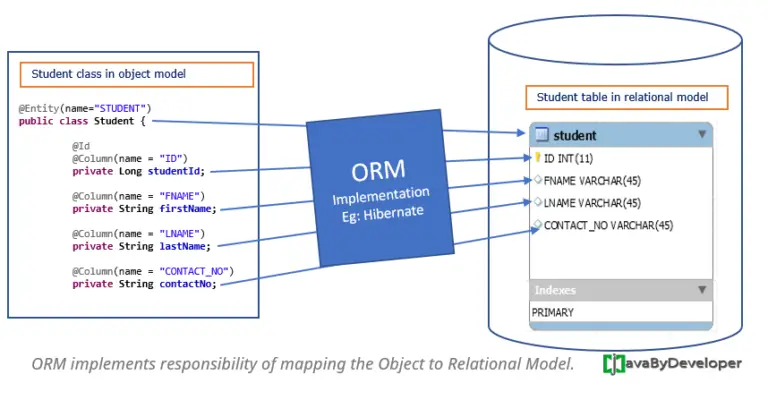
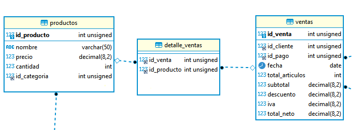
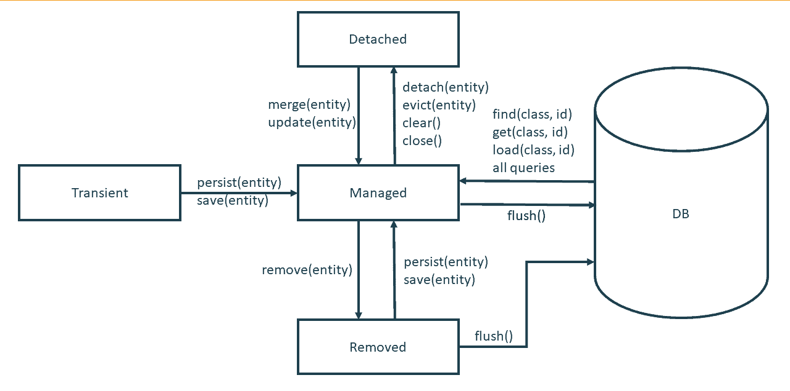

# 3. Persistencia con JPA e Hibernate
---

---

# 1. Introducción

## ¿Que es ORM (Object Relational Mapping)?

ORM o Mapeado de Objetos Relacionales es un sistema que implementa la responsabilidad de  mapear **************objetos************** al **********************************modelo relacional.********************************** Esto significa que es responsable de almacenar datos de un Modelo basado en ******************Objetos****************** en un Modelo ********************Relacional,******************** tambien es capaz de leer los datos de un Modelo Relacional y enviarlos al Modelo basado en Objetos.



Un ORM (Object Relational Mapping) es un modelo de programación que permite mapear las estructuras de una base de **datos relacional** (como SQL Server, Oracle, MySQL, etc.) sobre una estructura lógica de entidades o objetos **(Clases)**, con el objetivo de simplificar y acelerar el desarrollo de aplicaciones. Un ORM se apoya en objetos y clases para realizar la representación de una estructura relacional en el mundo dominio de los objetos. Un ORM también nos libera de la escritura o generación manual de código SQL, ya que las acciones CRUD (Create, Read, Update, Delete) se realizan de forma indirecta por medio del ORM. Algunos ejemplos de ORMs son Hibernate (para Java), Entity Framework (para .NET), Doctrine y Propel (para PHP), entre otros²⁴.

### ¿Por que trabajar con un ORM?

Cuando trabajamos con ********OOP******** para persistir datos en ****************************SGBD’s,**************************** pueden existir desajustes entre el modelo de objetos y el modelo relacional si se trabaja con tecnicas tradicionales como el uso directo de la API de Java ************JDBC.************ Un ********ORM********  se encarga de evitar esos desajustes que puedan llegar a surgir entre ambos modelos.

### Desajuste y diferencias entre un Modelo de objetos y un Modelo relacional

En el dominio del modelado de ****************objetos**************** se hace uso de las **************Clases************** mientras que en el dominio del modelado **********************relacional********************** se usan ********Tablas********. Esto llega a geneara una brecha entre ambos dominios debido a la diferencia entre los dos modelos, asi que obtener la informacion y asociaciaciones de ****************objetos**************** y llevarlos al modelo relacional con una estructura de (tabla) y viceversa requiere de un monton de programacion tediosa.

Esto nos lleva a que las acciones de lectura y almacenamiento de objetos en una estructura relacional de tipo tabla, expongan  5 problemas ocurrentes: 

- Granularity
- Inheritance
- Identity
- Associations
- Data Navigation

La solucion a estos problemas es usar una herramienta, framework o API ORM.

Un framework ORM nos provee de una API para persistir y leer objetos Java directamente a una base de datos relacional. Estas herramientas permiten a una apliacion desarrollada en un lenguaje orientado a objetos manejar la informacion como objetos directament en lugar de usar conceptos directamente relacionados a una base de datos como columnas, filas o tablas, esto se facilita por medio del mapeamiento relacional de objetos que nos provee el ORM.

## ¿Que es JPA?

JPA (Java Persistence API) es una ***especificacion*** que define como persistir datos en aplicaciones Java. El enfoque de JPA es la capa de mapeo objeto-relacional(ORM) que permite interactuar con un base de datos sin usar SQL. 

JPA representa una simplificación del modelo de programación de persistencia. La especificación JPA define explícitamente la correlación relacional de objetos, en lugar de basarse en implementaciones. JPA crea un estándar para la importante tarea de la correlación relacional de objetos mediante la utilización de anotaciones o XML para correlacionar objetos con una o más tablas de una base de datos. Para simplificar aún más el modelo de programación de persistencia:

- La API EntityManager puede actualizar, recuperar, eliminar o aplicar la persistencia de objetos de una base de datos.
- La API EntityManager y los metadatos de correlación relacional de objetos manejan la mayor parte de las operaciones de base de datos sin que sea necesario escribir código JDBC o SQL para mantener la persistencia.
- JPA proporciona un lenguaje de consulta, que amplía el lenguaje de consulta EJB independiente, conocido también como JPQL, el cual puede utilizar para recuperar objetos sin grabar consultas SQL específicas en la base de datos con la que está trabajando.

Un proveedor de persistencia JPA utiliza los elementos siguientes para habilitar una gestión de persistencia más fácil:

- **Unidad de persistencia:** Define un modelo relacional de objetos completo que  correlaciona clases Java (entidades + estructuras de soporte) con una  base de datos relacional. EntityManagerFactory utiliza estos datos para  crear un contexto de persistencia al que se puede acceder mediante EntityManager.
- **EntityManagerFactory:** Se utiliza para crear un EntityManager para las interacciones de base de datos. Una  instancia de EntityManagerFactory representa un contexto de  persistencia.
- **Contexto de persistencia:** Define el conjunto de las instancias activas que la aplicación está manipulando actualmente. Puede crear el contexto de persistencia manualmente o mediante inyección.
- **EntityManager**: Gestor de recursos que mantiene la colección activa  de objetos de entidad que está utilizando la aplicación. EntityManager maneja la interacción y metadatos de bases de datos para las correlaciones relacionales de objetos. Una instancia de EntityManager representa un contexto de persistencia.
- **Objetos de entidad:** Clase Java simple que representa una fila de una  tabla de base de datos en su forma más simple. Los objetos de entidades  pueden ser clases concretas o clasesabstractas. Mantienen estados mediante la utilización de propiedades o  campos.

## ¿Que es Hibernate?

Hibernate es uno de los frameworks ORM mas populares de Java, es una ***implementacion*** estandar de las especificaciones JPA con caracteristicas adicionales que son propias de Hibernate.

---

# 2. Comenzando con Hibernate: Configuracion

## Dependencias

Para comenzar a usar la API JPA con el Framework Hibernate necesitaremos crear un nuevo proyector e importar las dependencias necesarias.

```xml
<dependencies>
		<!--Hibernate-->
		<dependency>
			<groupId>org.hibernate</groupId>
			<artifactId>hibernate-entitymanager</artifactId>
			<version>5.6.14.Final</version>
		</dependency>
<!-- Dependencia para la base de datos H2-->
		<dependency>
			<groupId>com.h2database</groupId>
			<artifactId>h2</artifactId>
			<version>2.1.214</version>
		</dependency>
<!-- Dependencia para la base de datos MYSQL-->
	<dependency>
			<groupId>mysql</groupId>
			<artifactId>mysql-connector-java</artifactId>
			<version>8.0.32</version>
		</dependency>
</dependencies>
```

Y el build tambien:

```xml
<build>
		<plugins>
			<plugin>
				<groupId>org.apache.maven.plugins</groupId>
				<artifactId>maven-compiler-plugin</artifactId>
				<version>3.10.1</version>
				<configuration>
					<release>11</release>
				</configuration>
			</plugin>
		</plugins>
	</build>
```

> Nota: Dependiendo de la version de Hibernate que estemos importando como dependencia necesitaremos mas o menos dependencias, debido a la actualizacion tanto de la especificacion JPA, como del Framework Hibernate. En este caso la version JPA 2.2 y la version de Hibernate **[5.6.14.Final](http://5.6.14.Final)** no requieren mas dependencias de las que se muestran en este ejemplo.
> 

## Archivo persistence.xml

El fichero de configuracion ****************persitence.xml**************** contiene toda la informacion sobre las unidades de persitencia y las entidades relacionadas por lo que este fichero es la pieza central  de la configuracion de un proyecto JPA:Hibernate. Este por defecto no se genera al crear un nuevo proyecto por lo que debemos crearlo manualmente y en un directorio especifico.

El directorio debe ser en la carpete ********************resources******************** de nuestro proyecto y ahi debemos crear una carpeta nombrada como: **************************META-INF************************** dentro de ella crearemos un archivo llamado: ********************************persistence.xml.******************************** Como se muestra a continuacion.


Este fichero nos permite configurar y definir mas de una unidad de persitencia a la vez, podemos configurar cosas como:

- El nombre de la unidad de persitencia
- Que clases formaran parte de la unidad de persitencia.
- Como las clases deberian ser mapeadas a partir de las tablas de una Base de datos.
- El proveedor de persitencia (La base de datos Mysql, MariaDB, Postgress,etc).
- La base de datos a la cual nos conectaremos.
- Varios parametros de configuracion especificos del proveedor de persitencia.

## Unidades de persistencia

Una unidad de persistencia nos permite definir las caracteristicas y requerimientos de acceso a la base de datos con la cual estaremos trabajando. Todos los parametros que definamos en cada unidad de persistencia seran tomados por un EntityManager para crear un objeto de este tipo que posteriormente nos permitira operar sobre la base de datos.

### Cuerpo de una unidad de persistencia

El cuerpo de una unidad de persistencia se compone de la siguiente manera:

```xml
<?xml version="1.0" encoding="UTF-8"?>
<!-- Etiqueta contenedora de la unidad de persitencia en general-->
<persistence xmlns="http://xmlns.jcp.org/xml/ns/persistence"
             xmlns:xsi="http://www.w3.org/2001/XMLSchema-instance"
             xsi:schemaLocation="http://xmlns.jcp.org/xml/ns/persistence
             http://xmlns.jcp.org/xml/ns/persistence/persistence_2_2.xsd"
             version="2.2">
	<!-- Etiqueta contenedorea de una unidad de persitencia-->
	<persistence-unit name="nombre" transaction-type="[RESOURCE_LOCAL|JTA]">
			<!-- Etiqueta contenedora de las propiedades -->
			<properties>
					<!-- Etiquetas de definicion de las propiedades -->
					<property name="property-name1" value="valor1"></property>
					<property name="property-name2" value="valor1"></property>
					...
			</properties>
	</persistence-unit>
</persistence>
```

### Etiqueta: ``<persistence-unit>``

Esta es la etiqueta principal de nuestras unidades de persistencia, es decir, la etiqueta donde se define la configuracion hacia determinada base de datos podemos tener varias etiquetas de este tipo con una configuracion diferente de acuerdo a la base de datos con la cual se vaya a trabajar, lo cual nos permite almacenar diferentes unidades de persitencia en un mismo fichero de configuracion.

### Etiqueta: ``<properties>``

Esta etiqueta permite encapsular las propiedades de configuracion de nuestra unidad de persitencia.

### Etiqueta: ``<property>``

Se tratan de etiquetas indivuales que nos permiten definir cada una de las configuraciones de nuestra unidad de persistencia, estas se caracterizan por el hecho de llevar dos atributos que nos permiten definir el nombre de la propiedad y su valor de configuracion.

********Ejemplo:********

```xml
<property name="javax.persistence.jdbc.driver" value="org.h2.Driver" />
```

### Propiedades importantes

Las siguientes son propiedades de conexión a la base de datos.

```xml
<!-- Permite definir el driver de conexion a la base de datos-->
<property name="javax.persistence.jdbc.driver" value="org.h2.Driver" />

<!-- Permite definir la URL de conexion a la base de datos-->
<property name="javax.persistence.jdbc.url" value="jdbc:h2:mem:tienda;" />

<!-- Permite definir el nombre de usuario para conectarse a la base de datos-->
<property name="javax.persistence.jdbc.user" value="sa" />
<!-- Permite definir la contraseña de conexion a la base de datos-->
<property name="javax.persistence.jdbc.password" value="" />
```

Las siguientes son propiedades de Hibernate con H2:

```xml
<!-- Permite ver un log en la consola con las acciones realizadas en la base de datos-->
<property name="hibernate.show_sql" value="true"></property>

<!--Los logs de consola se imprimen formateados-->
<property name="hibernate.format_sql" value="true"></property>

<!-- Permite definir el lenguaje de la base de datos-->
<property name="hibernate.dialect" value="org.hibernate.dialect.H2Dialect" />

<!-- ??? -->
<property name="hibernate.hbm2ddl.auto" value="update"></property>
```

Las siguientes propiedades son para una conexion con MySQL:

```xml

<!--Driver de conexion a la BD-->
<property name="javax.persistence.jdbc.driver" value="com.mysql.jdbc.Driver" />
<!--URL de conexion a la BD-->
<property name="javax.persistence.jdbc.url" value="jdbc:mysql://localhost:3306/db_name" />
<!--Credenciales de conexion: usuario-->
<property name="javax.persistence.jdbc.user" value="user" />
<!--Credenciales de conexion: password-->
<property name="javax.persistence.jdbc.password" value="password" />
```

### Unidad de persistencia minima

Dadas las explicaciones anteriores, ahora mostramos como se deberia ver la unidad de persistencia con los parametros ya explicados.

```xml
<?xml version="1.0" encoding="UTF-8"?>
<persistence version="2.1"
	xmlns="http://xmlns.jcp.org/xml/ns/persistence"
	xmlns:xsi="http://www.w3.org/2001/XMLSchema-instance"
	xsi:schemaLocation="http://xmlns.jcp.org/xml/ns/persistence http://xmlns.jcp.org/xml/ns/persistence/persistence_2_1.xsd">

	<persistence-unit name="tienda"
		transaction-type="RESOURCE_LOCAL">

		<properties>
			<property name="javax.persistence.jdbc.driver"
				value="org.h2.Driver" />
			<property name="javax.persistence.jdbc.url"
				value="jdbc:h2:mem:tienda;MODE=LEGACY" />
			<property name="javax.persistence.jdbc.user" value="sa" />
			<property name="javax.persistence.jdbc.password" value="" />
			<property name="hibernate.show_sql" value="true"></property>
			<property name="hibernate.dialect" value="org.hibernate.dialect.H2Dialect" />
			<property name="hibernate.format_sql" value="true"></property>
			<property name="hibernate.hbm2ddl.auto" value="update"></property>
		</properties>
	</persistence-unit>
</persistence>
```

### Nota

En Frameworks diferentes a Hibernate es necesario agregar dentro de la etiqueta properties el nombre de las unidades de persitencia con la etiqueta ********<class>********nombre de la clase********</class>.********

# 3. Mapeando entidades

El mapeo de entidades es el proceso mediante el cual comenzamos a definir las tablas de un modelo relacional (base de datos) a un modelo orientado a objetos mas concretamente en Clases Java.

El proceso es simple hay que definir los campos de una tabla del modelo relacional en una clase Java que puede llevar o no el mismo nombre o uno similar. El tipo de los datos del modelo relacional debe ser equivalente al tipo de datos en el dominio del lenguaje de programacion orientado a objetos, se recomienda usar los tipos de datos referenciados para realizar esta definicion.


Ejemplo de mapeo de una tabla (modelo relacional) a una clase java (modelo de objetos).

**********************Ejemplo:********************** Dada la siguiente tabla de un modelo relacional.


Pasarlo a una clase Java:

```java
//Entidad-Clase Producto 
public class Producto {
	private Integer id;
	private String nombre;
	private String descripcion;
	private Double precio;
	private LocalDate fechaDeRegistro;
	private Categoria categoria;
}
```

Note como el atributo correspondiente a una llave foranea en el modelo relacional se representa como un tipo de dato ********int******** , mientras que el modelo de objetos se representa como una ************Clase************ esto debido a que tambien sera mapeada como clase Java puesto que representa otra tabla del modelo relacional, para indicar una asociacion entre estas en Java se vera una anotacion especifica para realizarlo en el apartado de anotaciones.

## Anotaciones

Una vez definidas las tablas del modelo relacional a clases java el siguiente paso para terminar de definir el mapeado de entidades, es agregar las anotaciones. Estas anotaciones forman parte de la ********JPA******** y sirven para que el Framework identifique a la clase Java como una entidad en el dominio de los objetos en el dominio relacional.

> Nota: cada anotacion va arriba de la declaracion de cada elemento que queramos mapear.
> 

## Anotaciones para Mapear un Entity

### @Entity

Para indicar que una Clase Java sera mapeada y observada por Hibernate usamos la anotacion: **************@Entity,************** la cual agregaremos arriba del nombre de la declaracion de la clase Java.

```java

@Entity
public class Producto {
	private Integer id;
	private String nombre;
	private String descripcion;
	private Double precio;
	private LocalDate fechaDeRegistro;
}
```

### @Table

Por defecto cada clase con la anotacion @Entity sera reconocida automaticamnete por JPA:Hibernate dado que el nombre de el nombre de la clase corresponde con el de la tabla de la basa de datos, sin embargo si esto no es asi, es decir, que la tabla tenga un nombre diferente o que use una notacion diferente a la de Java podemos hacer uso de la anotacion **@Table** para indicar que la entidad que estamos mapeando en Java tiene un nombre y en la base de datos puede que tenga otro.

Esta anotacion se puede definir con los siguientes atributos.

> **@Table( name = “”, schema=””)**
> 

Donde: 

- name: el nombre de la tabla en el modelo relacional.
- schema: nombre de la base de datos.

Podemos hacer uso solamente del atributo name.

```jsx
@Entity
@Table
public class Producto {
	private Integer id;
	private String nombre;
	private String descripcion;
	private Double precio;
	private LocalDate fechaDeRegistro;
}
```

## Anotaciones para mapear columnas:

Por defecto JPA mapea automáticamente los atributos de una clase java como las columnas de una tabla del modelo relacional siempre y cuando correspondan en el nombre y tipo de datos. Sin embargo podemos realizar diversas configuraciones con las anotaciones de columna como especificar un nombre diferente de la columna, especificar que atributo sera la llave primaria o foranea, etc.

### @Column

Esta anotacion es opcional y nos permite configurar el mapeamiento entre el atributo de la entidad y el campo de la tabla de la base de datos.

> **@Column(name = "title", updatable = false, insertable = true)**
> 

### @Id

JPA e Hibernate requieren que especifiquemos una llave primaria para cada entidad de manera obligatoria, para esto tenemos la anotacion: ******@Id.******

### @GeneratedValue

Una vez que mapeamos nuestro atributo que sera la llave primaria de nuestra entidad, necesitaremos especificar como se hara la generacion de la llave primaria, por ejemplo en MySql tenemos la opcion para especificar que un campo de una tabla se auto-incrementara automaticamente y esto lo podemos especificar con esta anotacion.

> ******************************************************************@GeneratedValue (strategy = “”)******************************************************************
> 

Donde:

- strategy: el tipo de estrategia en como se generara el valor de la llave primaria.

JPA nos provee de valores ya especificos que podemos usar para declarar este valor, mediante la clase ****************************GenerationType.**************************** La cual cuenta con los siguientes valores:

- ****************GenerationType.SEQUENCE:****************
- **GenerationType.IDENTITY:**

Ejemplo:

```java
@Entity
@Table
public class Producto {
	@Id
	@GenerationValue(strategy = GenerationType.IDENTITY)
	private Integer id;

	@Column(name = "name")
	private String nombre;
	private String descripcion;
	private Double precio;
	private LocalDate fechaDeRegistro;
}
```

### @Enumerated

Para mapear atributos de tipo **********enum********** usamos la anotacion Enumerated.

```jsx
@Enumerated(EnumType.STRING | EnumType.ORDINAL)
```

- ******************EnumType.STRING:****************** Almacena el valor en la base de datos como un valor de tipo varchar, es decir almacena el valor del enum.
- ************EnumType.ORDINAL:************ Almacena el valor en la base de datos como un valor numerico, es decir almacena el valor del indice del enum. Esta es la configuracion

Hay que tomar en cuenta que el atributo al que se le agrega esta anotacion debe ser una enumeracion Java con los valores que se correspondan con los de la base de datos.

********Ejemplo:********

******************Enum Java******************

```java
public enum Categoria{
	Electronica,
	Oficina,
	Hogar,
	Entretenimiento
}
```

********Mapeo de la entidad Producto:********

```java
@Entity
@Table (name="productos")
public class Producto {
	@Id
	@GenerationValue(strategy = GenerationType.IDENTITY)
	private Integer id;

	@Column(name = "name")
	private String nombre;
	private String descripcion;
	private Double precio;
	private LocalDate fechaDeRegistro;

	@Enumerated(EnumType.STRING);
	private Categoria categoria;

}
```

### Ejemplo de mapeamiento de una entidad

```java
@Entity
@Table (name="productos")
public class Producto {
	
	@Id
	@GeneratedValue (strategy = GenerationType.IDENTITY)
	private Integer id;

	private String nombre;
	private String descripcion;
	private Double precio;
	private LocalDate fechaDeRegistro;
}
```

---

# 4. Mapeo de relaciones

Estas anotaciones nos permiten asociar dos entidades (Dos clases Java) que representarian una relacion entre tablas en la base de datos.

En el modelo relacional estas relaciones son representadas en una tabla por la columna que almacena llaves foraneas. Estas relaciones son mapeadas en una clase como un atributo individual o una coleccion de dicho atributo.

Para especificar la relacion necesitamos obligatoriamente especificar el tipo de asociona en el atributo para que pueda ser mapeado. Para esto contamos con las siguientes anotaciones: @ManyToMany, @ManyToOne, @OneToMany, @ManyToOne, @OneToMany, @OneToOne.

Para leer las anotaciones de relacionamiento entr entidades, debemos enteder que la anotacion se divide en dos partes, entidad debil y fuerte. La fuerte es la que propaga su llave primaria como foranea a otra entidad y la debil es aquella que recibie alguna llave priamaria de otra tabla para mantener una relacion entre ambas.

Por ejemplo en la siguiente relacion:


Un cliente puede tener muchos telefonos registrados y varios telefonos pueden pertenecer solamente a un solo cliente. Cliente (1:1) <—> (M:1)Telefono, es una relacion uno a muchos de cliente a telefono.

```java
class Cliente{
	@Id
	@GeneratedValue(strategy=GenerationType.IDENTITY)
	@Column(name="id_cliente")
	private Integer id;
	//.. other cattrib definition

@OneToMany
	private List<Telefono> telefonos;
}

```

```java
class Telefono{
	@Id
	@GeneratedValue(strategy=GenerationType.IDENTITY)
	@Column(name="id_telefono")
	private Integer id;

	private String numero;
	
	@ManyToOne
	private Cliente cliente;
}
```

Por lo que la relacion se lee: One cliente To Many telefonos. Es decir el lado izquierdo de la anotacion hace referencia a entidad que pose dicha relacion y el lado derecho a la entidad que tiene almacenada la informacion completa.

## Relaciones unidireccionales y bidireccionales

Una relacion unidireccional es cuando solamente mapeamos la relacion entre entidades tal y como esta indicado en el modelo relacional por lo regular seria una relacion: Tabla A —> Tabla B.

Una relacion bidireccional es una relacion que nosotros establecemos mediante JPA Hibernate entre entidades en el dominio de los objetos java.

## Anotaciones para mapear Relaciones

### Relaciones ToOne

- ********************OneToOne:******************** Representa una relacion uno a uno entre entidades.
- ******************ManyToOne:****************** Representa una relacion de muchos a uno.

### Atributo fetch

Por defecto al realizar consultas entre entidades relacionadas con las anotaciones que terminen con ToOne tienen un comportamiento llamado EAGER el cual por defecto carga recursos no solicitados para evitar esto podemos cambiar dicho atributo por LAZY con lo cual solo carga los recursos solicitados, es decir no hace consultas ni joins que puedan estar demas como lo hace EAGER.

```java
@OneToOne(fetch = FetchType.EAGER | FetchType.Lazy);
@ManyToOne(fetch = FetchType.EAGER | FetchType.Lazy);
```

### Relacionamientos ToMany

- ********************OneToMany:********************  Representa una relacion uno a muchos.
- ******ManyToMany:****** Representa una relacion muchos a muchos.

### Referenciar llaves foraneas

Cuando hacemos un mapeo de una entidad que se encuentre relacionada y usamos algunas de las anotaciones de relacion para indicar que dicho elemento contiene la llave foranea de la relacion hay que agregar la anotacion JoinColumn(name = “pk_col_name”). Esto solamente en realciones unidireccionales.

## Configuraciones

### Fetch: Relaciones ToOne

Es un atributo especifo de las relacione **ToOne** el cual podemos cambiar o no. Por defecto cada relacion de este tipo tiene establecido el valor ************EAGER************ aunque lo podemos cambiar por ********LAZY.********

- ******************EAGER:****************** Carga los datos de entidades relacionadas mediante esta manera aunque no sean solicitados, lo cual genera problemas de rendimiento.
- **********LAZY:********** Carga los datos de las entidades relacionadas solamente cuando son solicitados aunque mejora el rendimiento de las aplicaciones tiene inconvenientes como el hecho de no poder cargar datos una vez que el EntityManager se ha cerrado, para solucionarlo debemos realizar una consulta con Join Fetch o el truco de llamar a un metodo del objeto que almacene los resultados antes de cerrar el EntityManager.

> ******************fetch = FetchType.LAZY | FetchType.EAGER******************
> 

********Ejemplo:********

```java
@ManyToOne(fetch = FetchType.LAZY)
@OneToOne(fetch = FetchType.EAGER)
```

### Cascade: Relaciones toMany

Las operaciones en cascada se dan en relaciones **************toMany************** cuando queremos realziar operaciones de persitencia en este tipo de relaciones, en lugar de hacer el persist uno por uno de varios objetos relacionados a una entidad podemos indicarle a la entidad relacionada como se comportara ante una accion de este tipo.

Supongamos la sigueinte relacion: Cliente ←→ Telefonos. Un cliente tiene muchos telefonos.

En entidades JPA tendiramos lo siguiente, mediante un relacionamiento unidireccional.

```java
//Entidad cliente
@Entity
@Table(name="clientes")
public class Cliente{
	@Id
	@GeneratedValue(strategy = GenerationType.IDENTITY)
	private Integer id;
	private String nombre;
	private String apellido;
	
	@OneToMany
	@JoinColumn(name="id")
	private List<Telefono> telefonos;
}

//Entidad telefonos
@Entity
@Table(name="telefonos")
public class Telefono{
	@Id
	@GeneratedValue(strategy = GenerationType.IDENTITY)
	private Integer id;
	private String descripcion;
	private String numero;

}
```

En este ejemplo tenemos que persistir los telefonos antes de persistir al cliente, de no ser asi o al agregar los telefonos al cliente fuera de la transaccion obtendriamos un error.

Sin error (persitiendo todo).

```java
//EJEMPLO
Telefono tel1 = new Telefono(1,"casa","5514270160");
Telefono tel2 = new Telefono(2,"celular","5585293776");

Cliente c1 = new Cliente(1, "Angel", "Hernandez");

em.getTransacction().begin();
	em.persist(tel1);
	em.persist(tel2);
		c1.addTelefono(tel1);
		c1.addTelefono(tel2);
	em.persist(c1);
em.close();
```

Error si añadimos los telefonos fuera de la transaccion o bien si no los persistimos antes.

```java
//EJEMPLO
Telefono tel1 = new Telefono(1,"casa","5514270160");
Telefono tel2 = new Telefono(2,"celular","5585293776");

Cliente c1 = new Cliente(1, "Angel", "Hernandez");
c1.addTelefono(tel1);
c1.addTelefono(tel2);

em.getTransacction().begin();
	
	em.persist(c1);
em.close();
```

Para no tener que persistir todo manualmente y uno por uno lo cual seria algo demasido laborioso JPA Hibernate, nos provee de la propiedad ****************cascade**************** que se le puede agregar a las relaciones ************ToMany************ y que es exclusiva de ellas. Con esto podemos añadir elementos de un relacionamiento sin tener que persitirlo manualmente ya que Hibernate por si mismo detecta que dichos objetos pertenencen al Objeto principal que se trata de persistir.

Se lo agregamos a la anotacion que define la relacion.

```java
//Entidad cliente
@Entity
@Table(name="clientes")
public class Cliente{
	@Id
	@GeneratedValue(strategy = GenerationType.IDENTITY)
	private Integer id;
	private String nombre;
	private String apellido;
	
	@OneToMany(cascade = CascadeType.ALL)
	@JoinColumn(name="id")
	private List<Telefono> telefonos;
}

//Entidad telefonos
@Entity
@Table(name="telefonos")
public class Telefono{
	@Id
	@GeneratedValue(strategy = GenerationType.IDENTITY)
	private Integer id;
	private String descripcion;
	private String numero;

}
```

Con lo cual solo tendriamos que instanciar nuestro objeto principal y los demas y solo persistir el objeto principal. Ya no tendriamos ningun error al hacer lo siguiente:

```java
//EJEMPLO
Telefono tel1 = new Telefono(1,"casa","5514270160");
Telefono tel2 = new Telefono(2,"celular","5585293776");

Cliente c1 = new Cliente(1, "Angel", "Hernandez");
c1.addTelefono(tel1);
c1.addTelefono(tel2);

em.getTransacction().begin();
	em.persist(c1);
em.close();
```

### JoinColumn: Relacionamientos Unidireccionales

Para hacer referencia a tablas que se encuentre relacionadas un a otra mediante sus llaves primarias debemos agregar la anotacion JoinColumn en al cual debemos especificar el nombre de la columna que almacena las llaves primarias en el modelo relacional.

### MappedBy : Relacionamientos Bidireccionales

Loa relacionamientos bidireccionales nos permiten relacionar Entidades en el dominio de los objetos incluso si en alguna de ellas no existe una llave foranea que la relacione a otra. Para hacer esto al meno una de ellas debera tener como referecnia una llave foranea que las relaciones. 

Para hacer este tipo de relacionamientos en el dominio de los objetos debemos agregar este atributo a la anotacion de la relacion de la entidad que no contiene llave foranea a otra tabla y especificar el nombre de la referencia en la otra entidad.

## Relacionamientos unidireccionales

### OneToOne


Tomando en cuenta la relacion anterior, donde un Cliente solo puede tener una sola Direccion y una Direccion le pertenece solo a un Cliente. El mapeamiento seria como se muestra a continuacion:

```java
@Entity
@Table (name="clientes")
class Cliente{
	@Id
	@GeneratedValue (strategy=GenerationType.IDENTITY)
	private Integer	id_cliente;
	//atribs
	@OneToOne(fetch=FetchType.LAZY)
	@JoinColumn(name="id_direccion")
	private Direccion direccion;
}
```

```java
@Entity
@Table (name="direcciones")
class Direccion{
	@Id
	@GeneratedValue (strategy=GenerationType.IDENTITY)
	private Integer	id_direccion;
}
```

### ManyToOne


Tomando en cuenta la relacion anterior, donde un Cliente puede tener multiples numeros telefonicos registrados y varios telefonos le puede pertenecer a un solo clieente. Muchos a Uno.

```java
@Entity
@Table (name="telefonos_cliente")
class Telefono{
	@Id
	@GeneratedValue (strategy=GenerationType.IDENTITY)
	private Integer	id_telefono;
	//atribs
	private String numero;
	
//relacion
	@ManyToOne(fetch=FetchType.LAZY)
	@JoinColumn(name="id_cliente")
	private Cliente cliente;
	
}
```

```java
@Entity
@Table (name="clientes")
class Cliente{
	@Id
	@GeneratedValue (strategy=GenerationType.IDENTITY)
	private Integer	id_cliente;
	//atribs
}
```

### OneToMany


En la relacion anterior, un paquete es enviado a un solo municipio pero un a un municipio pueden llegar varios paquetes. Un municipio recibe muchos paquetes. 

```java
@Entity
@Table (name="municipios")
class Municipio{
	@Id
	@GeneratedValue (strategy=GenerationType.IDENTITY)
	private Integer	id_municipio;
	//atribs
	private String nombre;
	//relaciones
	@OneToMany
	@JoinColumn(name="id_paquete")
	private List<Paquete> paquetes;
}
```

```java
@Entity
@Table (name="paquetes")
class Paquete{
	@Id
	@GeneratedValue (strategy=GenerationType.IDENTITY)
	private Integer	id_paquete;
	//atribs
}
```

### Many to Many



En la relacion anterior se genera una tercer tabla entre la relacion Producto ←→ Venta, dado que u una venta puede tener multiples productos y un producto puede formar parte de varias ventas siempre y cuando exista suficiente stock. Lo que tenemos aqui es una relacion muchos a muchos lo que en el dominio relacional nos obligaria a generar una tercer tabla para mantener normalizada dicha relacion.

Para representar esta relaciona en JPA Hibernate debemos mapear los atributos que hagan referencia a cada entidad con la anotacion **ManyToMany**. En este caso como dicha relacion no se especifica algun campo en la tercer tabla no es necesario generar una entidad para esta, pero en caso de que esto no fuera asi deberiamos hacerlo mas adelante mostraremos como.

************Pasos:************

- Mapear las entidades que forman la relacion, solo las tablas principales no las generadas por la relacion.
- Agrefar una referencia dentro de cada una entidad con la que se relaciona. Dicha referencia debera ser de algun tipo de lista puesto que representa a los muchos elementos que se relacionan con dicha entidad
- Agregar la anotacion ManyToMany a cada referencia.
- A la Entidad dueña agregar la anotacion JoinTable.
- A la Entidad Cliente agregar el atributo MappedBy en la declaracion del ManyToMany

## Relacionamientos Bidireccionales

Un relacionamiento bidireccional permite relacionar dos entidades relacionadas de manera unidireccional.

En la siguiente relacion existe un relacionamiento unidireccional de clientes a telefonos. Clientes —> Telefono, de tal manera que podemos saber mediante la entidad cliente sus numeros de telefono. Pero si quisieramos hacer lo contrario a partir de un numero de telefono saber a que cliente le pertenece no lo podemos hacer porque es un relacionmiento unidireccional en el dominio de los objetos.


Afortunadamente Hiberante JPA nos provee de las herramientas necesarias para hacer esto, y se llama relacionamiento bidireccional caracterizad por añadir una referencia mas a otra entidad para relacionarlo y hacer uso de la propiedad mappedBy.

**************Ejemplo**************

Mapeamos ambas entidades y añadimos a la entidad telefono una referencia a la entidad cliente que igual llevara su anotacion de relacion adecuada y el atributo mappedBy con el nombre del objeto que hace referencia a telefono en la clase cliente.

```java
//Entidad cliente
@Entity
@Table(name="clientes")
public class Cliente{
	@Id
	@GeneratedValue(strategy = GenerationType.IDENTITY)
	private Integer id;
	private String nombre;
	private String apellido;
	
	@OneToMany
	@JoinColumn(name="id")
	private List<Telefono> telefonos;
}

//Entidad telefonos
@Entity
@Table(name="telefonos")
public class Telefono{
	@Id
	@GeneratedValue(strategy = GenerationType.IDENTITY)
	private Integer id;
	private String descripcion;
	private String numero;
	//
	@OneToMany(mappedBy = "telefonos")
	private Cliente cliente;
}
```

# 5. Ciclo de vida de una entidad

Una entidad (objeto de nuestras clases mapeadas) cuenta con un ciclo de vida, conocerlo es importante pues dependiendo del estado en que se encuentre podremos realizar operaciones sobre el o no.



## Estado new o transient

Es el estado inicial de una entidad, en dicho estado la entidad se encuentra instancida sin embargo no esta siendo observada por Hiberanate ya que no ha formado parte de ninguna operacion de persistencia mediante el EntityManager.

```java
//Supongamos la clase Producto que ya se encuentra Mapeada
Producto telefono = new Producto("Huawei","Mate 20 Lite",50, 2500.00);
```

Se encuntra en estado ********************transient******************** ya ha sido instanciada pero no forma parte de ninguna operacion de persistencia. Para que cambie al estado ****************managed****************  y sea monitoreado por Hibernate debe formar parte de alguna operacion de persistencia entre los metodos ****.getTransaction.begin() y .close();.****

## Managed

En este estado las entidades se ecuentran siendo monitoreadas por hibernate y sucede cuando realizamos alguna operacion mediante el EntityManager como: commit, flush, find o merge. Una vez que se encuentra en este estado podemos realizar cambios en las entidades mediante sus  getters y setters, eliminarlos y actualizarlos y se veran reflejados en la base de datos.

```java
//Supongamos la clase Producto que ya se encuentra Mapead
Producto telefono = new Producto("Huawei","Mate 20 Lite",50, 2500.00);
//comenzamos una transaccion
em.getTransaction.begin();

em.persist(telefono);
//en este momento la entidad telefono pasa de estado transient a managed
em.flush();

//este cambio en la entidad telefono se vera reflejado en la base de datos
//ya que se encuentra en estado managed
telefono.setPrecio(3250.50);

em.close();
```

## Detached

En este estado las entidades ya no son observables por  hibernate, por lo que cualquier cambio que sufran no se veran reflejados en la base de datos. Este estado se logra cuando ejecutamos alguno de los metods suiguientes: **********************************************em.close(), em.clear(), em.detachs(entityInstance).**********************************************

```java
//Supongamos la clase Producto que ya se encuentra Mapead
Producto telefono = new Producto("Huawei","Mate 20 Lite",50, 2500.00);
//comenzamos una transaccion
em.getTransaction.begin();

em.persist(telefono);
//en este momento la entidad telefono pasa de estado transient a managed
em.flush();

//cambia el estado de todas las entidades managed a detached
em.clear();
//no tendra ninguna efecto en la base de datos pues la entidad esta en estdo detached
telefono.setPrecio(3200.50);

em.close();
```

## Removed

En este estado la entidad ha sido removida de la base de datos por lo que ya  no es visible para hibernate ni se encuentra en algun estado recuperable como detached.

```java
//Supongamos la clase Producto que ya se encuentra Mapead
Producto telefono = new Producto("Huawei","Mate 20 Lite",50, 2500.00);
//comenzamos una transaccion
em.getTransaction.begin();

em.persist(telefono);
//en este momento la entidad telefono pasa de estado transient a managed
em.flush();

//eliminamos la entidad telefono de la base de datos
em.remove(telefono);
em.flush();

em.close();
```

# 6. Persistiendo una entidad

Una vez que se ha definido el mapeamiento de las entidades con las anotaciones pertinentes el siguiente paso a realizar es la persistencia de las mismas entidades, para esto haremos uso de una serie de metodos que nos provee JPA/Hibernate.

Para realizar la persistencia en la base de datos deberemos seguir los siguientes pasos:

- Instanciar un objeto de tipo EntityManager.
- Indicar el inicio de transacciones.
- Ejecutar la persistencia.
- Indicar la finalizacion de transacciones.

## Creando unidad de persistencia

Para instanciar un objeto de la clase EntityManager deberemos realizar lo siguiente:

```java
//1.- Asignar a una variable de tipo EntityManagerFactory la instancia devuelta por 
//el metodo  createEntityManagerFactory(String unitName, Hash<> props ) de la clase
//Persistence

EntityManagerFactory factory = Persistence.
	createEntityManagerFactory("unitPersistenceName");

```

Donde:

- ****************************************unitPersistenceName:**************************************** Es el nombre de nuestra unidad de persitencia definido en el archivo de configuracion persistence.xml.
- ************props:************ Un objeto de tipo HashMap (propiead,valor) con configuraciones adicionales que se pueden añadir en tiempo de ejecucion.

Una vez hecho esto debemos asignar a un objeto de tipo ************EntityManager************ una instancia devuelta por el metodo createEntityManager() de nuestro objeto ****************Factory.****************

```java
//EntityManager
EntityManager em = factory.CreateEntityManger();
```

> Un objeto de tipo EntityManager se encarga de todas las operaciones de la base de datos, desde la conexion, CRUD y cierre.
> 

**********************************Ejemplo completo:**********************************

```java
//Factory
EntityManagerFactory factory = Persistence.
	createEntityManagerFactory("unitPersistenceName");
//EntityManager
EntityManager em = factory.CreateEntityManger();
```

## Comenzar y finalizar transacciones

Para comenzar a realizar operaciones en la base de datos mediante Hibernate  es necesario indicar el inicio de cada transaccion que se va a llevar acabo. Para hacer esto hacemos uso de los metodos ****************getTransaction.begin() y .close().****************

```java
//iniciando transacciones
em.getTransaction.begin()
	//operaciones a realizar
	//persists
	//update
	//remove
	//selects
	
//envia los cambios a la base de datos pero con la posibilidad de hacer rollback
em.flush();

//envia los cambios a la base de datos pero no HAY posibilidad de hacer rollback
em.getTransaction.commit();

//finalizando transacciones (cierra la conexion creada por el EntityManager)
em.close()
//Desde este punto no es posible realizar mas operaciones pues se ha cerrado
//la conexion****

```

El metodo ******************.flush()****************** permite enviar todos los cambios a la base de datos que se hayan hecho en los objetos de las entidades mapeadas con la posibilidad de revertir los cambios si algo salio mal (****************rollback****************).

El metodo **************************************************getTransaction.commit();************************************************** permite enviar todos los cambios a la base de datos que se hayan hecho en los objetos de las entidades mapeadas pero ************no hay************ posibilidad de revertir los cambios si algo salio mal (****************rollback****************).

## Persistir una Entidad (CRUD)

Cada uno de estos metodos lo que hace es modificar el estado de los objetos de las entidades mapeadas pero dichos cambios no se veran reflejados en la base de datos hasta que se realize una operacion de **************commit************** o ************flush.************

### Metodo persist

El metodo persiste nos permite almacenar una instancia de nuestras entidades mapeadas, este metodo recibe como parametro el objeto a almacenar en la base de datos y seria equivalente a la operacion de **************insert************** en una base de datos.

### Metodo remove

Este metodo nos permite eliminar una instancia de las entidades que ya tengamos para esto la instancia de la entidad a eliminar debe estar en estado ****************managed**************** el cual explicaremos mas adelante.

El metodo recibe el objeto de la entidad a eliminar como parametro.

### Metodo find

Este metodo devuelve un objeto de la entidad que se busca.

> ******************************find(type, id);******************************
> 

Donde 

- type: Clase del tipo de entidad que se busca
- id: id del elemento a busca en la tabla de la base de datos.

```java
Producto res = em.find(Producto.class, 19);
```

### Actualizar entidad Managed

Podemos actualizar los atributos de un objeto de nuestras entidades mapeadas mediante sus ************************************getters y setters,************************************ por lo que una vez que realizemos un commit o flush dichos cambios se veran reflejados en la base de datos, para esto hay que mencionar que es necesario que dichos objetos se encuentren en estado ****************managed**************** de lo contrario no podremos actualizarlos de esta manera.

### Actualizar entidad Detached

Cuando algun objeto de nuestras entidades mapeadas pase del estado **************managed************** al estado ******************detached****************** sera necesario hacer que hacer que vuelva al estado managed para poder actualizar sus datos en la base de datos, para eso haremos uso del metod ************merge************ el cual copia el estado de una entidad detached a una instancia managed del mismo tipo, con lo cual podremos realizar las operaciones sobre esta y enviarlos a la base de datos.

```java

//Entidad en estado new
Producto telefono = new Producto();

//Una vez que comenzamos una transaccion todos nuestros objetos de entidades 
//pasan al estado managed
em.getTransaction.begin();
//ahora telefono esta en estado managed

//hacemos un persist de nuestra entidad
em.flush();

//con el metodo clear ahora todas las entidades pasan a estado detached
em.clear();

//con el metodo merge recuperamos el estado managed de nuestra entidad
telefono = em.merge(telefono);
//realizamos los cambios necesarios

//podemos persistir de nuevo nuestra entidad
em.flush();
```

# 7. Consultas JPQL (Java Persistence Query Languaje)

JPQL (Lenguaje de consultas de persistencia java) es un lenguaje que nos permite ejecutar consultas con una sintaxis mucho mas sencilla a la del leguaje SQL que su vez es idependiente del SGBD (Sistema gestor de base de datos) por lo que podremos realizar consultas y una sola definicion mediante JPQL servira para cualquier SGBD soportado por Hiberanate.

## Consultas en formato JPQL

El lenguaje JPQL define un sintaxis mucho mas sencilla y que funciona con todos los SGBD soportados por Hibernate asi que basta con definir una sola consulta en este formato para poder ejecutarla aun si cambiamos de SGBD.

> Nota: Los nombres que se utilizan en este formato para hacer referencia a las tablas de la base de datos son los nombres de las entidades (clases java mapeadas);
> 

### Consultar todos los elementos

```sql
SELECT alias FROM EntityName AS alias;
```

Donde:

- alias: un alias o variable obligatorio que se le da a la entidad consultada.
- EntityName:  Nombre de la entidad que consultamos, es el nombre de la clase mapeada.

El formato anterior define una consulta de todos los elementos de una tabla de una base de datos.

### Consulta por atributo

```sql
SELECT alias FROM EntityName WHERE alias.Field =: field;
```

Donde:

- alias.Field : El nombre del atributo de la entidad por el cual haremos la consulta.
- field: El nombre del parametro que recibira el valor por el cual buscar.

**********Ejemplo:**********

```sql
SELECT prod FROM Producto as prod WHERE prod.id =: id;
```

### Consulta por varios atributos

```sql
SELECT alias FROM EntityName WHERE alias.Field =: field AND alias.FieldTwo =: fieldTwo
```

Usa la misma sintaxis que la consulta por un solo atributo solo que podemos agragar mas atributos con la palabara AND.

**Ejemplo:**

```sql
SELECT prod FROM Producto as prod WHERE prod.id =: id AND prod.precio <: precio
```

### Delimitar consultas

```sql
SELECT alias.FieldOne, alias.FieldTwo
	FROM EntityName as alias WHERE alias.field := field;
```

```sql
SELECT alias.FieldOne
	FROM EntityName as alias WHERE alias.field := field;
```

Podemos elegir obtener el resultado de una sola columna, con esta sintaxis.

### Consultar dos tablas (Where Joins)

```sql
SELECT alias FROM EntityName
	WHERE alias.foreignEntityName.field := field;
```

Donde:

- foreignEntityName: es el nombre del atributo de nuestra entidad que hace referencia a otra entidad y que contiene alguna anotacion que indica relacion como: ********@ManyToMany.******** Esta hace referencia a una relacion entre tablas en el modelo relacional que se da por el uso de llaves foraneas.
- field: el atributo por el cual se quiere hacer el match entre entidades.

**************Ejemplo**************

```sql
SELECT prod FROM Producto as prod WHERE prod.categoria.nombre=:nombre
```

En el ejemplo anterior se hace una consulta entre la entidad Producto y Categoria devolviendo todos los elementos de la entidad Producto que coincidan en el atributo nombre de categoria con la entidad Categoria.


Lo que en un modelo relacional seria igual a:


Con el añadido de que en lugar de traer todos los elementos que coincidan en el id de la llave foranea y la llave primaria de la tabla categoria, nos traeria devuelta los elementos que coincidan con el nombre de categoria que le pasemos co0mo parametro.

## Metodos para ejecutar consultas

### Crear query

******************************************************EntityManager.createQuery(query, class.type)******************************************************

Donde:

- query: Un String con la consulta a realizar en formato JPQL.
- class.type: Clase del tipo de entidad que se quire consultar.

Nos permite crear una consulta en formato JPQL, recibe como parametro una String con la consulta en formato JPQL.

### Establecer parametros

EntityManager.createQuery(query)******************************************************.setParameter(key, value);******************************************************

Donde.

- key: nombre del campo de la tabla que se quiere consultar
- value: valor del campo del elemento por el cual se hace la consulta

Nos permite establecer los parametros de consulta que se quiera realizar.

### Obtener resultados

EntityManager.createQuery(query).setParameter(key, value)******************************************************.getResultList();******************************************************

EntityManager.createQuery(query)******************************************************.getResultList();******************************************************

EntityManager.createQuery(query)******************************************************.getSingleResult();******************************************************

Existen diversos metodos que nos devuelven los resultados de la consulta, asi que elegir cual usar dependera de la misma consulta, por ejemplo si queremos obtener todos los elementos de una tabla lo mejore seria usar **********************************getResultList(),********************************** mientras que si hacemos una consulta para obtener una sola fila de la tabla lo mejor seria usar ******getSingleResult();******

### Ejemplo de uso

************************************************************************************Consulta todos los elementos de una tabla************************************************************************************ 

```java
//Consulta todos los elementos de una tabla lo cual seria equivalente a:
//Select *from tableName;
List<Producto> resultados;

//Consulta en formato JPQL
String query = "SELECT prod FROM Producto as prod";

//Ejecucion de la consulta
resultados = this.em.createQuery(query, Producto.class).getResultList();

//imprime los resultados		
resultados.forEach(prod ->{
		System.out.println(this.gson.toJson(prod));
		System.out.println();
});
```

******************************Consulta por campo******************************

```java
//Consulta todos los elementos de la tabla que tengan un precio menor al 
//que se le pase como parametro
//lo cual seria igual: SELECT *FROM produto WHERE precio<parametro;

String jpql = "SELECT prod FROM Producto as prod "
	+" WHERE prod.precio<:precio ";
		
List<Producto> resultados;
Double precio = 3500.00;

resultados = this.em.createQuery(jpql, Producto.class)
			.setParameter("id", id)
			.getResultList();
			
//imprime los resultados		
resultados.forEach(prod ->{
		System.out.println(this.gson.toJson(prod));
		System.out.println();
});
```

---

# 7.Relaciones avanzadas

## Funciones de agregacion

## Joins

---

---

# Documentación e Información

Origen: Conversación con Bing, 19/4/2023
(1) Qué es un ORM y por qué utilizarlo en el desarrollo de aplicaciones. [https://fp.uoc.fje.edu/blog/que-es-un-orm-y-por-que-utilizarlo-en-el-desarrollo-de-aplicaciones/](https://fp.uoc.fje.edu/blog/que-es-un-orm-y-por-que-utilizarlo-en-el-desarrollo-de-aplicaciones/).
(2) ¿Qué es un ORM? - Deloitte Spain. [https://www2.deloitte.com/es/es/pages/technology/articles/que-es-orm.html](https://www2.deloitte.com/es/es/pages/technology/articles/que-es-orm.html).
(3) ¿Qué es un ORM en programación? - Platzi. [https://platzi.com/clases/2987-entity-framework/49169-que-es-un-orm/](https://platzi.com/clases/2987-entity-framework/49169-que-es-un-orm/).
(4) ¿Qué es un ORM? - CódigoFacilito. [https://codigofacilito.com/articulos/orm-explicacion](https://codigofacilito.com/articulos/orm-explicacion).

[https://www.ibm.com/docs/es/was-liberty/nd?topic=overview-java-persistence-api-jpa](https://www.ibm.com/docs/es/was-liberty/nd?topic=overview-java-persistence-api-jpa)

[https://www.tutorialspoint.com/hibernate/orm_overview.htm](https://www.tutorialspoint.com/hibernate/orm_overview.htm)

[https://www.javaguides.net/p/hibernate-tutorial.html](https://www.javaguides.net/p/hibernate-tutorial.html)


