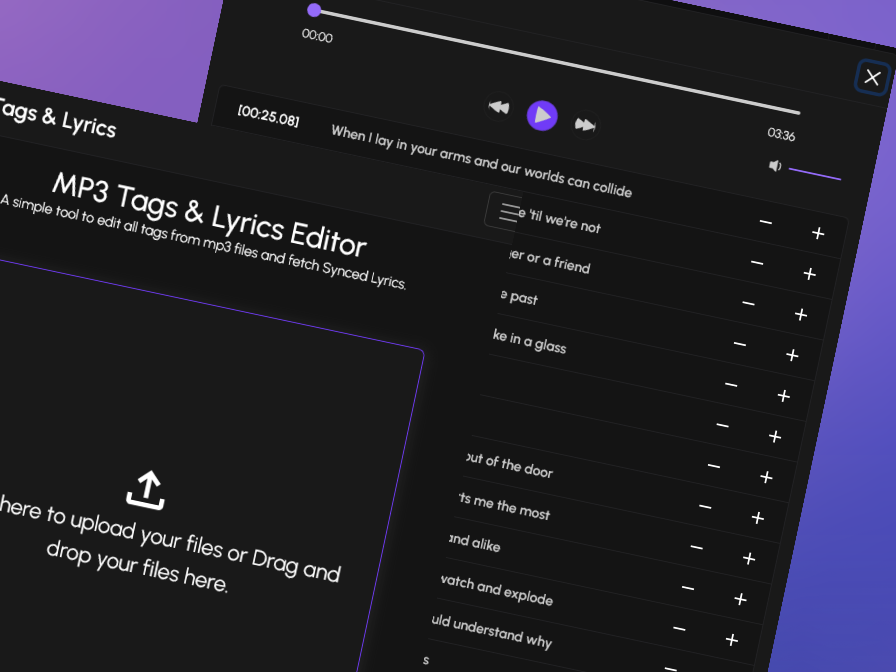
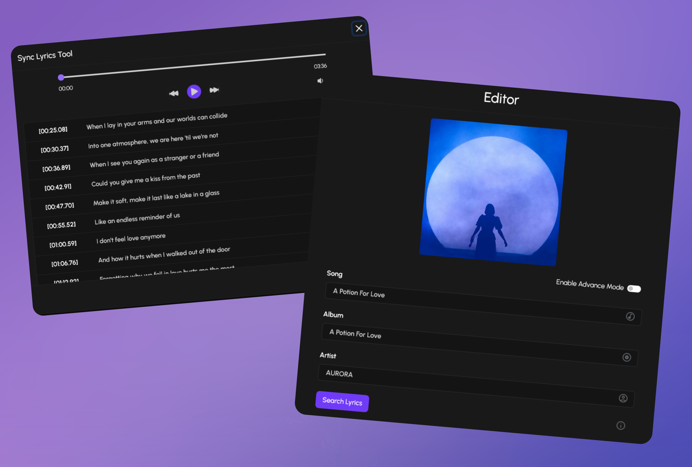
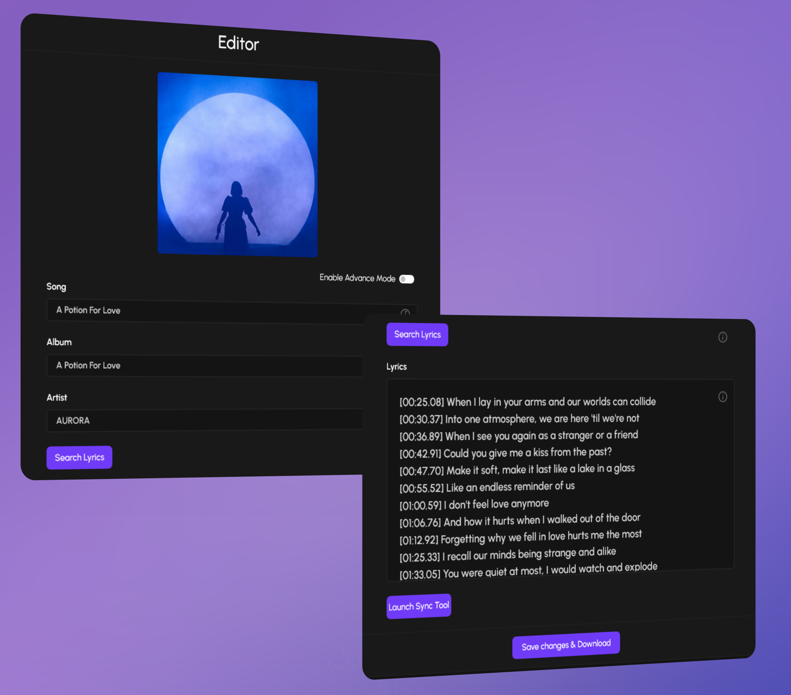

# MP3 Lyrics

Una herramienta web que te permite obtener y sincronizar las letras de canciones en formato ".mp3", asi mismo te 
ofrece la capacidad de editar las etiquetas de los ficheros manualmente.

<a class="live-button" href="https://mp3-lyrics.vercel.app/" target="_blank">
    

        Live Preview
    

</a>

Una de las caracteristicas mas conocidas de los ficheros de audio ".mp3" es la capacidad de almacenar los metadatos
o etiquetas con la información sobre dicho fichero de audio que despues pueden ser visualizados por el reproductor de 
audio que utilizemos. Su uso mas comun es para mostrar la informacion del artista relacionado a dicho fichero de audio.

## Problematica

lorem

## Solucion

lorem