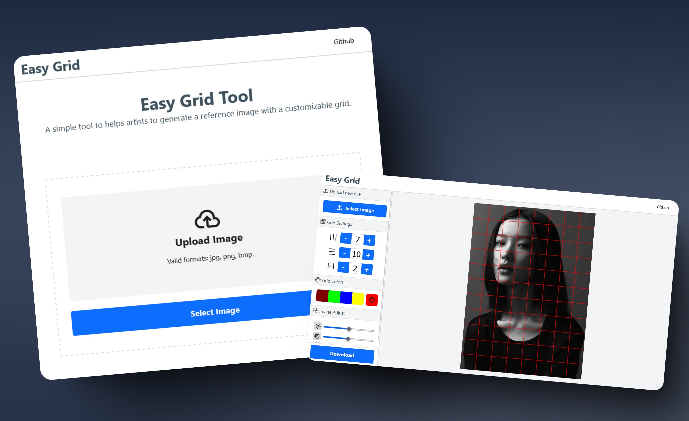
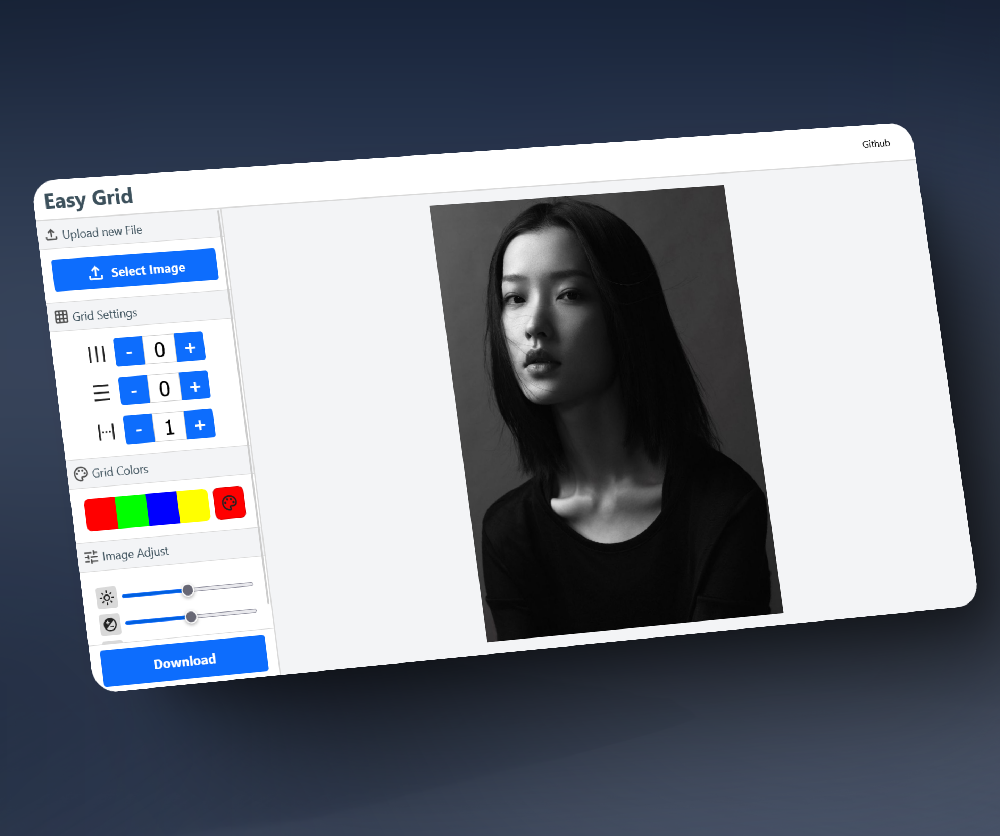
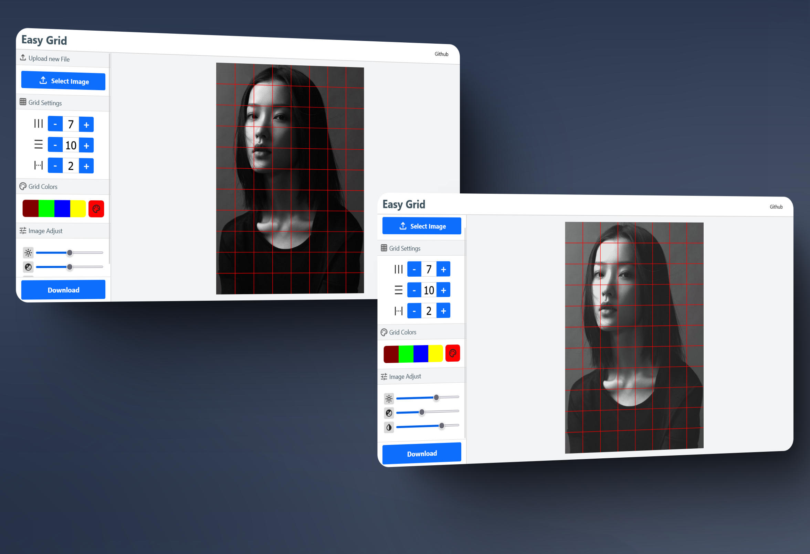

# MP3 Lyrics

Una herramienta web que te permite obtener añadir una cuadricula personalizada a tus imagenes de manera rápida y sencilla. De esta manera
podras tener tus imagenes de referencia para dibujar en un instante.

<a class="squared-button" href="https://mp3-lyrics.vercel.app/" target="_blank">Live Preview</a>

Se te hace tedioso utilizar Photoshop o cualquier otra herramienta de edición de imagenes para añadir cuadriculas a tus imagenes de referencia, pues con esta herramienta en unos cuantos "clicks" las puedes obtener.

## Problematica

Muchos artistas y dibujantes necesitan agregar cuadrículas a sus imágenes de referencia para facilitar el proceso de dibujo y proporciones. Sin embargo, la mayoría de los programas de edición de imágenes como Photoshop pueden ser complicados, costosos o requieren muchos pasos para realizar esta tarea sencilla. Esto puede hacer que el flujo de trabajo sea más lento y menos eficiente, especialmente para quienes buscan una solución rápida y accesible desde cualquier dispositivo.

## Solucion

Grid Tool ofrece una solución simple y eficiente: una aplicación web gratuita y accesible desde cualquier navegador, sin necesidad de instalaciones ni conocimientos avanzados. Permite cargar imágenes, personalizar la cantidad y el color de las líneas de la cuadrícula, y descargar el resultado en segundos. Así, los artistas pueden preparar sus referencias de manera rápida y enfocarse en lo más importante: crear.